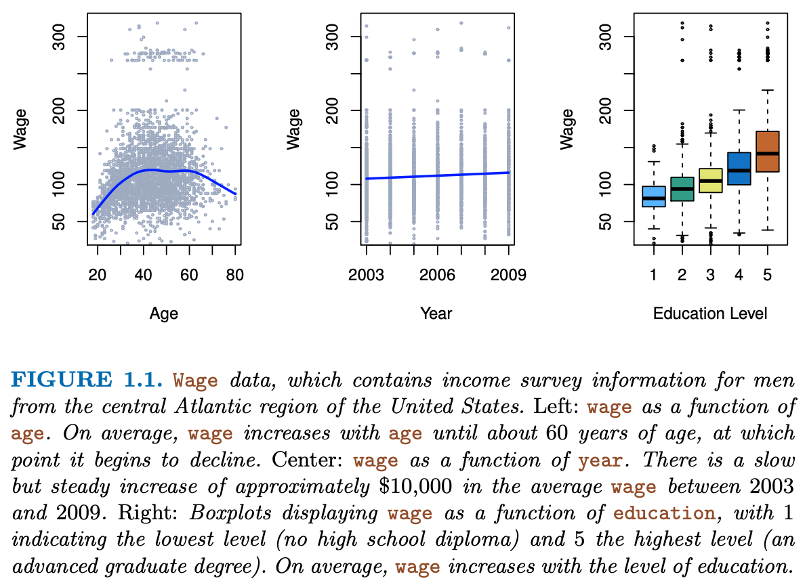
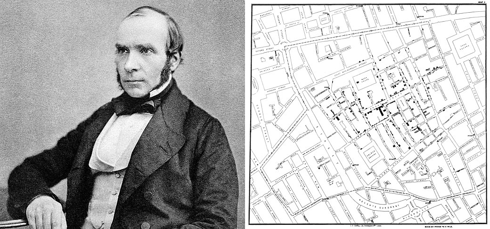
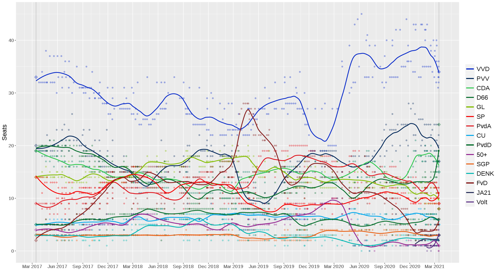
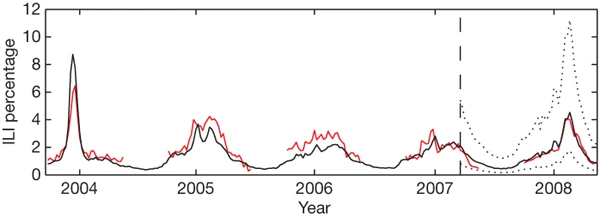
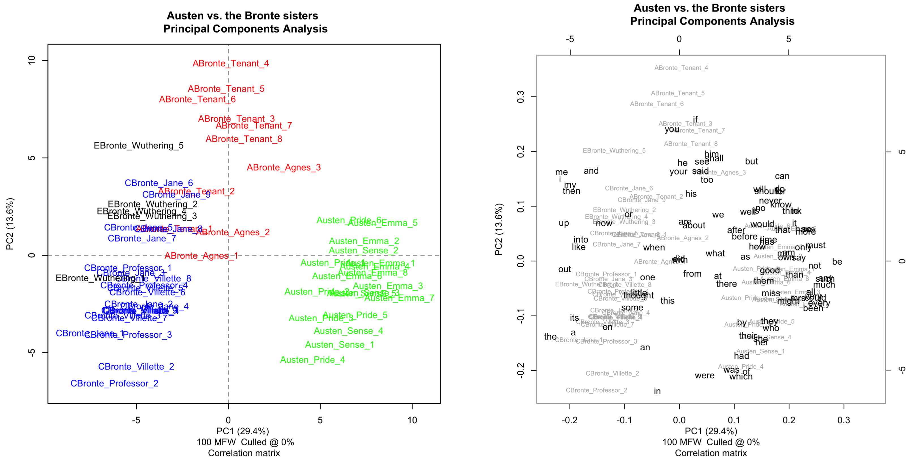

```{r setup, include=FALSE}
knitr::opts_chunk$set(echo = TRUE)
```

<style>

.notepaper {
  position: relative;
  margin: 30px auto;
  padding: 29px 20px 20px 45px;
  width: 680px;
  line-height: 30px;
  color: #6a5f49;
  text-shadow: 0 1px 1px ;
  background-color: #f2f6c1;
  background-image: -webkit-radial-gradient(center, cover, rgba(255, 255, 255, 0.7) 0%, rgba(255, 255, 255, 0.1) 90%), -webkit-repeating-linear-gradient(top, transparent 0%, transparent 29px, rgba(239, 207, 173, 0.7) 29px, rgba(239, 207, 173, 0.7) 30px);
  background-image: -moz-radial-gradient(center, cover, rgba(255, 255, 255, 0.7) 0%, rgba(255, 255, 255, 0.1) 90%), -moz-repeating-linear-gradient(top, transparent 0%, transparent 29px, rgba(239, 207, 173, 0.7) 29px, rgba(239, 207, 173, 0.7) 30px);
  background-image: -o-radial-gradient(center, cover, rgba(255, 255, 255, 0.7) 0%, rgba(255, 255, 255, 0.1) 90%), -o-repeating-linear-gradient(top, transparent 0%, transparent 29px, rgba(239, 207, 173, 0.7) 29px, rgba(239, 207, 173, 0.7) 30px);
  border: 1px solid #c3baaa;
  border-color: rgba(195, 186, 170, 0.9);
  -webkit-box-sizing: border-box;
  -moz-box-sizing: border-box;
  box-sizing: border-box;
  -webkit-box-shadow: inset 0 1px rgba(255, 255, 255, 0.5), inset 0 0 5px #d8e071, 0 0 1px rgba(0, 0, 0, 0.1), 0 2px rgba(0, 0, 0, 0.02);
  box-shadow: inset 0 1px rgba(255, 255, 255, 0.5), inset 0 0 5px #d8e071, 0 0 1px rgba(0, 0, 0, 0.1), 0 2px rgba(0, 0, 0, 0.02);
}

.notepaper:before, .notepaper:after {
  content: '';
  position: absolute;
  top: 0;
  bottom: 0;
}

.notepaper:before {
  left: 28px;
  width: 2px;
  border: solid #efcfad;
  border-color: rgba(239, 207, 173, 0.9);
  border-width: 0 1px;
}

.notepaper:after {
  z-index: -1;
  left: 0;
  right: 0;
  background: rgba(242, 246, 193, 0.9);
  border: 1px solid rgba(170, 157, 134, 0.7);
  -webkit-transform: rotate(2deg);
  -moz-transform: rotate(2deg);
  -ms-transform: rotate(2deg);
  -o-transform: rotate(2deg);
  transform: rotate(2deg);
}

.quote {
  font-family: Georgia, serif;
  font-size: 14px;
}

.curly-quotes:before, .curly-quotes:after {
  display: inline-block;
  vertical-align: top;
  height: 30px;
  line-height: 48px;
  font-size: 50px;
  opacity: .2;
}

.curly-quotes:before {
  content: '\201C';
  margin-right: 4px;
  margin-left: -8px;
}

.curly-quotes:after {
  content: '\201D';
  margin-left: 4px;
  margin-right: -8px;
}

.quote-by {
  display: block;
  padding-right: 10px;
  text-align: right;
  font-size: 13px;
  font-style: italic;
  color: #84775c;
}

.lt-ie8 .notepaper {
  padding: 15px 25px;
}

div.footnotes {
  position: absolute;
  bottom: 0;
  margin-bottom: 70px;
  width: 80%;
  font-size: 0.6em;
}
</style>

<script src="https://ajax.googleapis.com/ajax/libs/jquery/3.1.1/jquery.min.js"></script>
<script>
$(document).ready(function() {
  $('slide:not(.backdrop):not(.title-slide)').append('<div class=\"footnotes\">');

  $('footnote').each(function(index) {
    var text  = $(this).html();
    var fnNum = (index+1).toString();
    $(this).html(fnNum.sup());

    var footnote   = fnNum + '. ' + text + '<br/>';
    var oldContent = $(this).parents('slide').children('div.footnotes').html();
    var newContent = oldContent + footnote;
    $(this).parents('slide').children('div.footnotes').html(newContent);
  });
});
</script>

## This lecture

1. Course pages
2. Course overview
3. Introduction to SLV
4. (Dark) Data Science
6. Data Wrangling
7. Wrap-up

## Disclaimer
I owe a debt of gratitude to many people as the thoughts and teachings in my slides are the process of years-long development cycles and discussions with my team, friends, colleagues and peers. When someone has contributed to the content of the slides, I have credited their authorship. 

When external figures and other sources are shown: 

1) the references are included when the origin is known, or 
2) the objects are directly linked from within the public domain and the source can be obtained by right-clicking the objects. 

Opinions are my own. 

I am a statistician

## Procedural stuff
- If there is anything important - contact me!
- The on-location lectures will not be recorded. 

  - If you are ill, ask your classmates to cover for you.
  
- If you feel that you are stuck, and the wait for the Q&A session is too long: [open a GitHub issue here](https://github.com/gerkovink/INFOMDA1-2022/issues/). 

  - You are most likely not the only one with that question. You are simply the bravest or the first. 
  - **Do not contact us via private chat or e-mail for content-related questions**.
  - use a [`reprex`](https://reprex.tidyverse.org) to detail your issue, when code is involved. 
- If you expect that you are going to miss some part(s) of the course, please notify me via a private MS-Teams message or e-mail.

## Course pages
You can find all materials at the following location:

<center>[https://www.gerkovink.com/slv/](https://www.gerkovink.com/slv/)</center>
<br>

All course materials should be submitted through a pull-request from your Fork of

<center>[https://github.com/gerkovink/INFOMDA1-2022](https://github.com/gerkovink/INFOMDA1-2022)</center>
<br>

The structure of your submissions should follow the corresponding repo's README. To make it simple, I have added an example for the first practical. 
If you are unfamiliar with [GitHub](https://github.com), forking and/or pull-request, please study [this exercise](https://www.gerkovink.com/markup/Wk1/Exercise_1.html) from one of my other courses. There you can find video walkthroughs that detail the process. 

# Course overview

## Team

<center>  
<br>

[Gerko Vink](https://www.gerkovink.com), [Maarten Cruyff](https://www.uu.nl/staff/mcruyff) and [Erik-Jan van Kesteren](https://erikjanvankesteren.nl) </center>

<br>
<br>

All three have a PhD in statistics and a ton of experience in development, data analysis and visualization. 

## Topics

| Week # | Focus | Teacher | Materials | 
|--------|---------------------|--------|-----------|
| 1 | Data wrangling with `R` | GV | [R4DS](https://r4ds.had.co.nz) [ISLR](https://web.stanford.edu/~hastie/ISLR2/ISLRv2_website.pdf)| 
| 2 | The grammar of graphics | GV | [R4DS](https://r4ds.had.co.nz) | 
| 3 | Exploratory data analysis | GV | [R4DS](https://r4ds.had.co.nz) [FIMD](https://stefvanbuuren.name/fimd/ch-introduction.html) | 
| 4 | Statistical learning: regression | MC | ISLR, TBD |
| 5 | Statistical learning: classification | EJvK | ISLR, TBD |
| 6 | Classification model evaluation | EJvK | ISLR, TBD |
|	7 | Nonlinear models | MC | ISLR, TBD |
| 8 | Bagging, boosting, random forest and support vector machines | MC | ISLR, TBD |

## Course Setup

Each weak we have the following:

  - 1 Lecture on Monday @ 9am in [BBG 201](https://www.uu.nl/en/buys-ballot-building)
  - 1 Practical (not graded). Must be submitted to pass. Hand in the practical before the next lecture
  - 1 combined workgroup and Q&A session in [BBG 106](https://www.uu.nl/en/buys-ballot-building)
  - Course materials to study. See the corresponding week on [the course page](https://www.gerkovink.com/slv/).

Twice we have:

  - Group assignments
  - The assignment is made in teams (3-4 students). 
  - Each assignment counts towards 25% of the total grade. Must be > 5.5 to pass. 

Once we have:

  - Individual exam
  - BYOD: so charge and bring your laptop.
  - 50% of total grade. Must be > 5.5 to pass.

## Groups 

We will make groups on Wednesday Sept 14!

# Introduction to SLV

## Terms I may use

- TDGM: True data generating model
- DGP: Data generating process, closely related to the TDGM, but with all the wacky additional uncertainty
- Truth: The comparative truth that we are interested in
- Bias: The distance to the comparative truth
- Variance: When not everything is the same
- Estimate: Something that we calculate or guess 
- Estimand: The thing we aim to estimate and guess
- Population: That larger entity without sampling variance
- Sample: The smaller thing with sampling variance
- Incomplete: There exists a more complete version, but we don't have it
- Observed: What we have
- Unobserved: What we would also like to have

# Some statistics

## At the start

We begin this course series with a bit of statistical inference. 

<div class="notepaper">
  <figure class="quote">
    <blockquote class="curly-quotes" cite="https://www.youtube.com/watch?v=qYLrc9hy0t0">
    <font color="black">
    Statistical inference is the process of drawing conclusions from truths
    </font>
    </blockquote>
  </figure>
</div>

Truths are boring, but they are convenient. 

- however, for most problems truths require a lot of calculations, tallying or a complete census. 
- therefore, a proxy of the truth is in most cases sufficient 
- An example for such a proxy is a **sample**
- Samples are widely used and have been for a long time<footnote>See [Jelke Bethlehem's CBS discussion paper](https://www.google.com/url?sa=t&rct=j&q=&esrc=s&source=web&cd=&ved=2ahUKEwjkyPTCs4L3AhUCuKQKHUpmBvIQFnoECAMQAw&url=https%3A%2F%2Fwww.cbs.nl%2F-%2Fmedia%2Fimported%2Fdocuments%2F2009%2F07%2F2009-15-x10-pub.pdf&usg=AOvVaw3BpUW2s_k0MB5yH1o-QGf2) for an overview of the history of sampling within survey statistics</footnote>

## Being wrong about the truth
<div style="float: left; width: 40%;">
{width=90%}
</div>

<div style="float: right; width: 60%;">
- The population is the truth
- The sample comes from the population, but is generally smaller in size
- This means that not all cases from the population can be in our sample
- If not all information from the population is in the sample, then our sample may be *wrong*
<br><br><br>
Q1: Why is it important that our sample is not wrong?<br>
Q2: How do we know that our sample is not wrong?

</div>

<div style="clear: both;"></div>


## Solving the missingness problem
<div style="float: left; width: 40%;">
{width=90%}
</div>

<div style="float: right; width: 60%;">
- There are many flavours of sampling
- If we give every unit in the population the same probability to be sampled, we do **random sampling**
- The convenience with random sampling is that the missingness problem can be ignored
- The missingness problem would in this case be: **not every unit in the population has been observed in the sample**

<br><br><br>
Q3: Would that mean that if we simply observe every potential unit, we would be unbiased about the truth?

</div>

<div style="clear: both;"></div>

## Sidestep
<div style="float: left; width: 50%;">
{width=90%}
</div>

<div style="float: right; width: 50%;">
- The problem is a bit larger
- We have three entities at play, here:

  1. The truth we're interested in
  2. The proxy that we have (e.g. sample)
  3. The model that we're running
  
- The more features we use, the more we capture about the outcome for the cases in the data
- The more cases we have, the more we approach the true information
<br><br><br>
All these things are related to uncertainty. Our model can still yield biased results when fitted to $\infty$ features. Our inference can still be wrong when obtained on $\infty$ cases. 
</div>

<div style="clear: both;"></div>

## Sidestep
<div style="float: left; width: 50%;">
{width=90%}
</div>

<div style="float: right; width: 50%;">
- The problem is a bit larger
- We have three entities at play, here:

  1. The truth we're interested in
  2. The proxy that we have (e.g. sample)
  3. The model that we're running
  
- The more features we use, the more we capture about the outcome for the cases in the data
- The more cases we have, the more we approach the true information
<br><br><br>

**Core assumption: all observations are bonafide**
</div>

<div style="clear: both;"></div>

## Uncertainty simplified
<div style="float: left; width: 70%;">
{width=90%}
</div>

<div style="float: right; width: 30%;">
When we do not have all information ...

1. We need to accept that we are probably wrong
2. We just have to quantify how wrong we are

<br>
In some cases we estimate that we are only a bit wrong. In other cases we estimate that we could be very wrong. This is the purpose of testing. 
<br><br>
The uncertainty measures about our estimates can be used to create intervals
</div>

<div style="clear: both;"></div>

## Rumsfeld moment of fame in statistics
<iframe width="560" height="315" src="https://www.youtube.com/embed/GiPe1OiKQuk" title="YouTube video player" frameborder="0" allow="accelerometer; autoplay; clipboard-write; encrypted-media; gyroscope; picture-in-picture" allowfullscreen></iframe>

## Confidence intervals
<div style="float: left; width: 70%;">
{width=90%}
</div>

<div style="float: right; width: 30%;">
Confidence intervals can be hugely informative!

If we sample 100 samples from a population, then a *95% CI* will cover the population value at least 95 out of 100 times. 

- If the coverage <95: bad estimation process with risk of errors and invalid inference
- If the coverage >95: inefficient estimation process, but correct conclusions and valid inference. Lower statistical power. 
</div>

<div style="clear: both;"></div>

## The other type of intervals
<div style="float: left; width: 60%;">
{width=90%}
</div>

<div style="float: right; width: 40%;">
Prediction intervals can also be hugely informative!

Prediction intervals are generally wider than confidence intervals

- This is because it covers inherent uncertainty in the data point on top of sampling uncertainty
- Just like CIs, PIs will become more narrow (for locations) where more information is observed (less uncertainty)
- Usually this is at the location of the mean of the predicted values.

<br>
**Narrower intervals mean less uncertainty. It does not mean less bias!**

</div>

<div style="clear: both;"></div>

## The holy trinity
Whenever I evaluate something, I tend to look at three things:

- bias (how far from the truth)
- uncertainty/variance (how wide is my interval)
- coverage (how often do I cover the truth with my interval)

<br>
As a function of model complexity in specific modeling efforts, these components play a role in the bias/variance tradeoff

<center>
{width=40%}
</center>

## Now with missingness
<div style="float: left; width: 30%;">
{width=60%}
</div>

<div style="float: right; width: 70%;">
We now have a new problem:

- we do not have the whole truth; but merely a sample of the truth
- we do not even have the whole sample, but merely a sample of the sample of the truth. 

Q4. What would be a simple solution to allowing for valid inferences on the incomplete sample? <br>
Q5. Would that solution work in practice?
</div>

<div style="clear: both;"></div>

## Now with missingness
<div style="float: left; width: 30%;">
{width=68%}
</div>

<div style="float: right; width: 70%;">
We now have a new problem:

- we do not have the whole truth; but merely a sample of the truth
- we do not even have the whole sample, but merely a sample of the sample of the truth. 

Q4. What would be a simple solution to allowing for valid inferences on the incomplete sample? <br>
Q5. Would that solution work in practice?
</div>

<div style="clear: both;"></div>

## The statistical solution
<div style="float: left; width: 60%;">
{width=80%}
</div>

<div style="float: right; width: 40%;">
There are two sources of uncertainty that we need to cover:

1. **Uncertainty about the missing value**:<br>when we don't know what the true observed value should be, we must create a distribution of values with proper variance (uncertainty).
2. **Uncertainty about the sampling**:<br>nothing can guarantee that our sample is the one true sample. So it is reasonable to assume that the paramaters obtained on our sample are biased. 

<br>
**More challenging if the sample does not randomly come from the population or if the feature set is too limited to solve for the substantive model of interest**

<div style="clear: both;"></div>

## Now how do we know we did well?
I'm really sorry, but:
<div class="notepaper">
  <figure class="quote">
    <blockquote class="curly-quotes" cite="https://www.youtube.com/watch?v=qYLrc9hy0t0">
    <font color="black">
    We don't. In practice we may often lack the necessary comparative truths!
    </font>
    </blockquote>
  </figure>
</div>

For example:

1. Predict a future response, but we only have the past
2. Analyzing incomplete data without a reference about the truth
3. Estimate the effect between two things that can never occur together
4. Mixing bonafide observations with bonafide non-observations

# What to do with uncertainty without a truth?

## Scenario 
Let's assume that we have an incomplete data set and that we can impute (fill in) the incomplete values under multiple models

**Challenge**<br>
Imputing this data set under one model may yield different results than imputing this data set under another model. 

**Problem**<br>
We have no idea about validity of either model's results: we would need either the true observed values or the estimand before we can judge the performance and validity of the imputation model.

<div class="notepaper">
  <figure class="quote">
    <blockquote class="curly-quotes" cite="https://www.youtube.com/watch?v=qYLrc9hy0t0">
    <font color="black">
    We do have a constant in our problem, though: **the observed values**
    </font>
    </blockquote>
  </figure>
</div>

## Solution

<div style="float: left; width: 50%;">
{width=80%}
</div>

<div style="float: right; width: 50%;">
We can *overimpute* the observed values and evaluate how well the models fit on the observed values. 

The assumption would then be that any good imputation model would properly cover the observed data (i.e. would fit to the observed data). 

- If we overimpute the observations multiple times we can calculate bias, intervals and coverage. 
- The model that would be unbiased, properly covered and have the smallest interval width would then be the most efficient model. 

The model to the left clearly does not fit well to the observations.
</div>

<div style="clear: both;"></div>

## Solution

<div style="float: left; width: 50%;">
{width=80%}
</div>

<div style="float: right; width: 50%;">
We can *overimpute* the observed values and evaluate how well the models fit on the observed values. 

The assumption would then be that any good imputation model would properly cover the observed data (i.e. would fit to the observed data). 

- If we overimpute the observations multiple times we can calculate bias, intervals and coverage. 
- The model that would be unbiased, properly covered and have the smallest interval width would then be the most efficient model. 

The model to the left fits quite well to the observations.

<br> Q6. Can we infer truth?
</div>

<div style="clear: both;"></div>

# Bringing it in perspective

## Focus points

1. What are statistical learning and visualization?
2. How does it connect to data analysis?
3. Why do we need the above?
4. What types of analyses and learning are there?

## Some example questions
- Did our imputations make sense?
- Who will win the election?
- Is the climate changing?
- Why are women underrepresented in STEM degrees?
- What is the best way to prevent heart failure?
- Who is at risk of crushing debt?
- Is this matter undergoing a phase transition?
- What kind of topics are popular on Twitter?
- How familiar are incoming DAV students with several DAV topics? 

## Goals in data analysis

- **Description**: <br> What happened?
- **Prediction**: <br> What will happen?
- **Explanation**: <br> Why did/does something happen?
- **Prescription**: <br> What should we do?

### Modes in data analysis
- **Exploratory**: <br> Mining for interesting patterns or results
- **Confirmatory**: <br> Testing hypotheses

## Some examples
|  | Exploratory                | Confirmatory      |
|--------------|----------------------------|-------------------|
| Description  | EDA; unsupervised learning | One-sample t-test |
| Prediction   | Supervised learning        | Macro-economics   |
| Explanation  | Visual mining       | Causal inference  |
| Prescription | Personalised medicine      | A/B testing       |

## In this course
- **Exploratory Data Analysis**: <br> 
Describing interesting patterns: use graphs, summaries, to understand
subgroups, detect anomalies, understand the data <br>
Examples: boxplot, five-number summary, histograms, missing data plots, ...

- **Supervised learning**: <br>
Regression: predict continuous labels from other values.<br>
Examples: linear regression, support vector machines, regression trees, ... Classification: predict discrete labels from other values. <br>
Examples: logistic regression, discriminant analysis, classification trees, ...

<center>
{width=50%} <br>
[image source](https://www.researchgate.net/publication/326175998_Analysis_of_Control_Attainment_in_Endogenous_Electroencephalogram_Based_Brain_Computer_Interfaces)
</center>

## Exploratory Data Analysis workflow
<center>
 <br>
[image source](https://www.researchgate.net/publication/326175998_Analysis_of_Control_Attainment_in_Endogenous_Electroencephalogram_Based_Brain_Computer_Interfaces)
</center>

## Data analysis

How do you think that `data analysis` relates to:

- “Data analytics”?
- “Data modeling”?
- “Machine learning”?
- “Statistical learning”?
- “Statistics”?
- “Data science”?
- “Data mining”?
- “Knowledge discovery”?

## Explanation

People from different fields (such as statistics, computer science, information science, industry) have different goals and different standard approaches.

- We often use the same techniques.
- We just use different terms to highligh different aspects of so-called `data analysis`. 
- All the terms on the previous slides are not exact synonyms. 
- But according to most people they carry the same analytic intentions. 

In this course we emphasize on **drawing insights that help us understand the data.**

# Some examples

## Spaceshuttle Challenger
<div style="float: left; width: 40%;">
{width=100%}
</div>
<div style="float: right; width: 50%;">
```{r failure, echo = FALSE, message=FALSE, warning=FALSE, fig.height = 3.5, fig.width=4}
library(tidyverse)
library(ggplot2)
library(alr4)

Challeng %>% 
  filter(fail > 0) %>% 
  ggplot(aes(temp, fail)) +
  geom_jitter(height = .1, width = .01) + 
  geom_smooth(method = "lm", se = FALSE) +
  ylim(0, 5) + xlim(35, 85) + 
  ylab("Number of distressed O−rings at each launch") +
  xlab("Temperature in degrees Fahrenheit") + 
  theme_classic()
```
</div>
<div style="clear: both;"></div>
36 years ago, on 28 January 1986, 73 seconds into its flight and at an altitude of 9 miles, the space shuttle Challenger experienced an enormous fireball caused by one of its two booster rockets and broke up. The crew compartment continued its trajectory, reaching an altitude of 12 miles, before falling into the Atlantic. All seven crew members, consisting of five astronauts and two payload specialists, were killed.

## How wages differ
<center>
{width=60%}
</center> <br>
[Source: ISLR2, pp. 2](https://web.stanford.edu/~hastie/ISLR2/ISLRv2_website.pdf)


## The origin of cholera
<center>
{width=100%} <br>
[Source: wikimedia commons](https://nl.wikipedia.org/wiki/John_Snow)
</center>

## Predicting the outcome of elections
<center>
{width=80%} <br>
[Source: Hans Muster](https://gitlab.com/gbuvn1/opinion-polling-graph)
</center>

## Google Flu Trends
Google used a linear model to calculate the log-odds of Influence-like illness (ILI) physician visit and the log-odds of ILI-related search queries per
$$\operatorname{logit}(P)=\beta _{0}+\beta _{1}\times \operatorname{logit}(Q)+\epsilon$$
where $P$ is the percentage of ILI physician visit and $Q$ is the ILI-related query fraction computed. 
<center>
{width=70%} <br>
</center>
[Ginsberg, J., Mohebbi, M., Patel, R. et al. Detecting influenza epidemics using search engine query data. Nature 457, 1012–1014 (2009)](https://www.nature.com/articles/nature07634)

## Identifying Brontës from Austen
<center>
{width=90%} <br>
</center>
[Eder, Maciej & Rybicki, Jan & Kestemont, Mike. (2016). Stylometry with R: A Package for Computational Text Analysis. The R Journal. 8. 107-121. 10.32614/RJ-2016-007. ](https://svn.r-project.org/Rjournal/html/archive/2016-1/eder-rybicki-kestemont.pdf)

## The tree of life
<div class="columns-2">
  {width=95%}
  
  [Hug, L., Baker, B., Anantharaman, K. et al. A new view of the tree of life. Nat Microbiol 1, 16048 (2016)](https://www.nature.com/articles/nmicrobiol201648)

</div>

## The tree of life
<center>
{width=97%} <br>
</center>
[Image source](https://flowingdata.com/2018/10/25/tree-of-life/)

## Exercise
<center>
<div class="columns-2">
  Challenger disaster<br>
  How wages differ<br>
  Jon Snow and Cholera<br>
  Election prediction<br><br>
  
  Flu trends<br>
  Brontë or Austen <br>
  Elevation, climate and forest <br>
  The tree of life <br>
</div>
</center>
<br>

**Where would you place each example in the table?**

- Does each example fit in just one cell of the table?
- For each of these analyses, we can ask some common questions, such as:
  - “How well does the model fit the data?”
  - “How well does the model do on new, unseen, data?” 
  - ...
<br>

**Can we think of other common questions?**

**Can we think of an example of a case where the model did not do well?**

## Nothing happened, so we ignored it
<div style="float: left; width: 50%;">
```{r darkdata, echo = FALSE, message=FALSE, warning=FALSE, fig.width = 4}
Challeng %>% 
  ggplot(aes(temp, fail)) +
  geom_point() + 
  geom_smooth(method = "lm", se = FALSE) +
  ylim(0, 5) + xlim(35, 85) + 
  ylab("Number of distressed O−rings at each launch") +
  xlab("Temperature in degrees Fahrenheit") + 
  theme_classic()

```
</div>
<div style="float: right; width: 50%;">
In the decision process that led to the unfortunate launch of spaceshuttle challenger, some dark data existed.

***Dark data*** is information that is not available. 

Such unavailable information can mislead people. The notion that we could potentially be misled is important, because we then need to accept that our outcome analysis or decision process might be faulty. 
<br><br>

**If you do not have all information, there is always a possibility that you arrive at an invalid conclusion or a wrong decision.**
</div>

# From data collection to output

## Why analysis and visualization?

- When high risk decisions are at hand, it paramount to analyze the correct data. 

- When thinking about important topics, such as whether to stay in school, it helps to know that more highly educated people tend to earn more, but also that there is no difference for top earners.

- Before John Snow, people thought “miasma” caused cholera and they fought it by airing out the house. It was not clear whether this helped or not, but people thought it must because “miasma” theory said so

- Election polls vary randomly from day to day. Before aggregating services like `Peilingwijzer`, newspapers would make huge news items based on noise from opinion polls.

- If we know flu is coming two weeks earlier than usual, that’s just enough time to buy shots for very weak people.

- If we know how ecosystems are affected by temperature change, we know how our forests will change in the coming 50-100 years due to climate change.

## Why analysis and visualization?

- Scholars fight over who wrote various songs (Wilhelmus), treatises (Caesar), plays (Shakespeare), etc., with shifting arguments. By counting words, we can sometimes identify the most likely author of a text, and we can explain exactly why we think that is the correct answer.

- Biologists have been constructing the tree of life based on appearance of the animal/plant. But sometimes the outward appearance corresponds by chance. DNA is a more precise method, because there is more of it, and because it is more directly linked to evolution than appearance. But there is so much of it that we need automated methods of reconstructing the tree.

## There is a need

The examples have in common that data analysis and the accompanying visualizations have yielded insights and solved problems that could not be solved without them.

-  On some level, humans do nothing but analyze data;
-  They may not do it consistently, understandibly, transparently, or correctly,
however;
-  DAV help us process more data, and can keep us honest;
-  DAV can also exacerbate our biases when we are not careful.

## Thought
<center>
{width=60%}
</center>
[Source: Mike Lee](https://www.mikelee.co/animation/2017-06-28-wsj-measles-vaccination-chart/)

# Data wrangling

## Wrangling in the pipeline

Data wrangling is the process of transforming and mapping data from one "raw" data form into another format. 

  - The process is often iterative
  - The goal is to add purpose and value to the data in order to maximize the downstream analytical gains

<center>
{width=80%}
</center>
[Source: R4DS](https://r4ds.had.co.nz/wrangle-intro.html)

## Core ideas
- **Discovering**: The first step of data wrangling is to gain a better understanding of the data: different data is worked and organized in different ways.
- **Structuring**:The next step is to organize the data. Raw data is typically unorganized and much of it may not be useful for the end product. This step is important for easier computation and analysis in the later steps.
- **Cleaning**: There are many different forms of cleaning data, for example one form of cleaning data is catching dates formatted in a different way and another form is removing outliers that will skew results and also formatting null values. This step is important in assuring the overall quality of the data.
- **Enriching**: At this step determine whether or not additional data would benefit the data set that could be easily added.
- **Validating**: This step is similar to structuring and cleaning. Use repetitive sequences of validation rules to assure data consistency as well as quality and security. An example of a validation rule is confirming the accuracy of fields via cross checking data.
- **Publishing**: Prepare the data set for use downstream, which could include use for users or software. Be sure to document any steps and logic during wrangling.

[Source: Trifacta](https://www.trifacta.com/data-wrangling/)

## To Do

- Study [ISLR Chapter 1](https://web.stanford.edu/~hastie/ISLR2/ISLRv2_website.pdf)
- Study [R4DS Chapters 1 and 9-16](https://r4ds.had.co.nz)
- Make and hand in the practical before the next lecture

If you are unfamiliar with R, [this crash course into scripting may be helpful](https://www.gerkovink.com/prepR)


