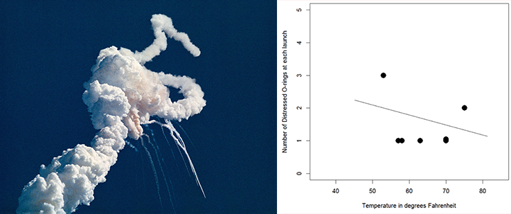
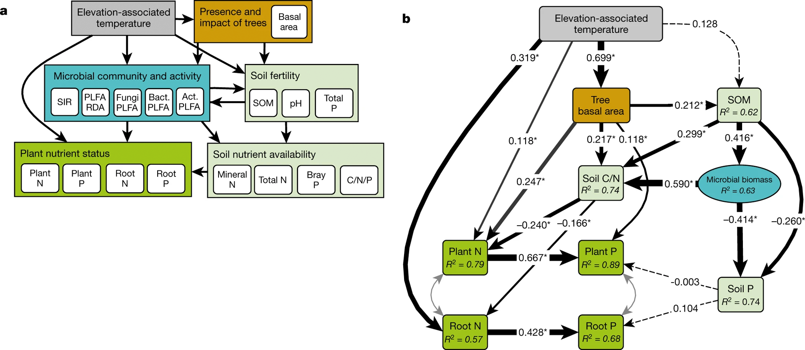
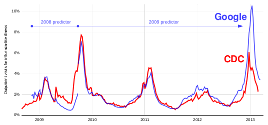
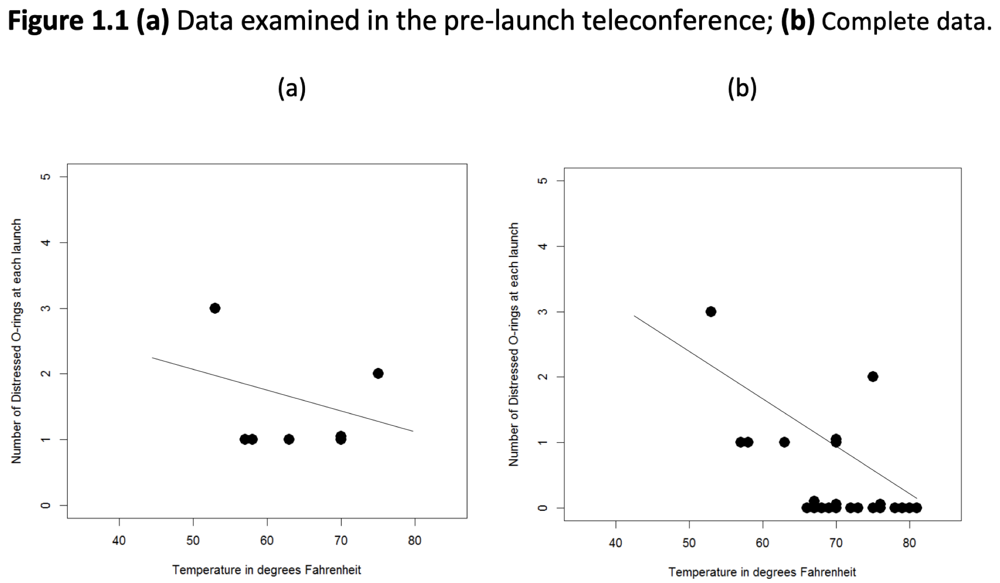

```{r setup, include=FALSE}
knitr::opts_chunk$set(echo = TRUE)
```

## This lecture

1. Covid and the course
2. Course pages
3. Course overview
4. Introduction to SLV
5. Some examples
6. Data Wrangling
7. Wrap-up

## Disclaimer

Parts of this week's slides may be based on materials from previous iterations of `Data Analysis and Visualization` courses. The authors of these materials include, but may not be limited to: Erik-Jan van Kesteren, Daniel Oberski and Peter van der Heijden. 

When figures and other external sources are shown, the references are included when the origin is known. 

## Covid and the course
With the exception of the first lecture, all lectures are on location. There are some rules by which we obide:

Covid related:

- You are required to wear a face-mask when moving. Please do so. 
- You may remove your mask when seated in the lecture hall, if you want. You do not have to.  
- Make use of the available space in the lecture rooms. 
- If you have doubts about your health, please skip class and contact a medical professional.
- Please take other peoples wishes, needs, rights and freedom into consideration. 
- We have a seperate online Q&A session every week to allow for more student-teacher interaction.

## Covid and the course
Procedure related:

- The first lecture will be recorded because of schedule clashes. 
- The on-location lectures will not be recorded. 

  - If you are ill, ask your classmates to cover for you.
  
- If you feel that you are stuck, and the wait for the Q&A session is too long: [open a GitHub issue here](https://github.com/gerkovink/INFOMDA1-2021/issues/). 

  - You are most likely not the only one with that question. You are simply the bravest or the first. 
  - **Do not contact the teachers via private chat or e-mail**.
  - use a [`reprex`](https://reprex.tidyverse.org) to detail your issue, when code is involved. 
  
- If you expect that you are going to miss some part(s) of the course, please notify me via a private MS-Teams message.

## Course pages
You can find all materials at the following location:

<center>[https://www.gerkovink.com/slv/](https://www.gerkovink.com/slv/)</center>
<br>

All course materials should be submitted through a pull-request from your Fork of

<center>[https://github.com/gerkovink/INFOMDA1-2021](https://github.com/gerkovink/INFOMDA1-2021)</center>
<br>

The structure of your submissions should follow the corresponding repo's README. To make it simple, I will add an example for the first of each submission type. 

If you are unfamiliar with [GitHub](https://github.com), forking and/or pull-request, please study [this exercise](https://www.gerkovink.com/markup/Wk1/Exercise_1.html) from one of my other courses. There you can find video walkthroughs that detail the process. 


# Course overview

## Team

<center>  
<br>

[Gerko Vink](https://www.gerkovink.com), [Maarten Cruyff](https://www.uu.nl/staff/mcruyff) and [Erik-Jan van Kesteren](https://erikjanvankesteren.nl) </center>

<br>
<br>

All three have a PhD in statistics and a ton of experience in development, data analysis and visualization. 

## Topics

| Week # | Focus | Teacher | Materials | 
|--------|---------------------|--------|-----------|
| 1 | Data wrangling with `R` | GV | [R4DS](https://r4ds.had.co.nz) [ISLR](https://web.stanford.edu/~hastie/ISLR2/ISLRv2_website.pdf)| 
| 2 | The grammar of graphics | GV | [R4DS](https://r4ds.had.co.nz) | 
| 3 | Exploratory data analysis | GV | [R4DS](https://r4ds.had.co.nz) [FIMD](https://stefvanbuuren.name/fimd/ch-introduction.html) | 
| 4 | Statistical learning: regression | MC | ISLR, TBD |
| 5 | Regression model evaluation | MC | ISLR, TBD |
| 6 | Statistical learning: classification | EJvK | ISLR, TBD |
| 7 | Classification model evaluation | EJvK | ISLR, TBD |
|	8 | Nonlinear models | MC | ISLR, TBD |
| 9 | Bagging, boosting, random forest and support vector machines | MC | ISLR, TBD |

## Course Setup

Each weak we have the following:

  - 1 Lecture on Monday @ 9am in [Ruppert D](https://goo.gl/maps/ZL959UVy7ne8bRMD7)
  - 1 Practical (not graded). Must be submitted to pass. Hand in the practical before the next lecture
  - 1 online Q&A session. 
  - Course materials to study. See the corresponding week on [the course page](https://www.gerkovink.com/slv/).

Twice we have:

  - Group assignments
  - The assignment is made in teams. 
  - Each assignment counts towards 25% of the total grade. Must be > 5.5 to pass. 

Once we have:

  - Individual exam
  - BYOD: so charge and bring your laptop.
  - 50% of total grade. Must be > 5.5 to pass.

## Groups 

We will make groups on Monday Sept 13!

# Introduction to SLV

## Focus points

1. What are statistical learning and visualization?
2. How does it connect to data analysis?
3. Why do we need the above?
4. What types of analyses and learning are there?

## Some example questions
- Who will win the election?
- Is the climate changing?
- Why are women underrepresented in STEM degrees?
- What is the best way to prevent heart failure?
- Who is at risk of crushing debt?
- Is this matter undergoing a phase transition?
- What kind of topics are popular on Twitter?
- How familiar are incoming DAV students with several DAV topics? 

## Goals in data analysis

- **Description**: <br> What happened?
- **Prediction**: <br> What will happen?
- **Explanation**: <br> Why did/does something happen?
- **Prescription**: <br> What should we do?

## Modes in data analysis
- **Exploratory**: <br> mining for interesting patterns or results
- **Confirmatory**: <br> Testing hypotheses

## Some examples
|  | Exploratory                | Confirmatory      |
|--------------|----------------------------|-------------------|
| Description  | EDA; unsupervised learning | One-sample t-test |
| Prediction   | Supervised learning        | Macro-economics   |
| Explanation  | Visual mining       | Causal inference  |
| Prescription | Personalised medicine      | A/B testing       |

## In this course
- **Exploratory Data Analysis**: <br> 
Describing interesting patterns: use graphs, summaries, to understand
subgroups, detect anomalies, understand the data <br>
Examples: boxplot, five-number summary, histograms, missing data plots, ...

- **Supervised learning**: <br>
Regression: predict continuous labels from other values.<br>
Examples: linear regression, support vector machines, regression trees, ... Classification: predict discrete labels from other values. <br>
Examples: logistic regression, discriminant analysis, classification trees, ...

<center>
{width=50%} <br>
[image source](https://www.researchgate.net/publication/326175998_Analysis_of_Control_Attainment_in_Endogenous_Electroencephalogram_Based_Brain_Computer_Interfaces)
</center>

## Exploratory Data Analysis workflow
<center>
 <br>
[image source](https://www.researchgate.net/publication/326175998_Analysis_of_Control_Attainment_in_Endogenous_Electroencephalogram_Based_Brain_Computer_Interfaces)
</center>

## Data analysis

How do you think that `data analysis` relates to:

- “Data analytics”?
- “Data modeling”?
- “Machine learning”?
- “Statistical learning”?
- “Statistics”?
- “Data science”?
- “Data mining”?
- “Knowledge discovery”?

## Explanation

People from different fields (such as statistics, computer science, information science, industry) have different goals and different standard approaches.

- We often use the same techniques.
- We just use different terms to highligh different aspects of so-called `data analysis`. 
- All the terms on the previous slides are not exact synonyms. 
- But according to most people they carry the same analytic intentions. 

In this course we emphasize on **drawing insights that help us understand the data.**

# Some examples

## Remember

|  | Exploratory                | Confirmatory      |
|--------------|----------------------------|-------------------|
| Description  | | |
| Prediction   | | |
| Explanation  | | |
| Prescription | | |

## Challenger disaster
<center>
{width=100%}
</center><br>
[Source: wikimedia commons](https://en.wikipedia.org/wiki/File:Challenger_explosion.jpg) and [MIMP summerschool slide 28](https://www.gerkovink.com/mimp/Contents/Lectures/MIMP2021-slides.pdf)

Challenger space shuttle - 28 Jan 1986 - 7 deaths


## How wages differ
<center>
{width=70%}
</center> <br>
[Source: ISLR2, pp. 2](https://web.stanford.edu/~hastie/ISLR2/ISLRv2_website.pdf)


## The origin of cholera
<center>
{width=100%} <br>
[Source: wikimedia commons](https://nl.wikipedia.org/wiki/John_Snow)
</center>

## Predicting the outcome of the 2021 Dutch elections
<center>
{width=80%} <br>
[Source: Hans Muster](https://gitlab.com/gbuvn1/opinion-polling-graph)
</center>

## Google Flu Trends
Google used a linear model to calculate the log-odds of Influence-like illness (ILI) physician visit and the log-odds of ILI-related search queries per
$$\operatorname{logit}(P)=\beta _{0}+\beta _{1}\times \operatorname{logit}(Q)+\epsilon$$
where $P$ is the percentage of ILI physician visit and $Q$ is the ILI-related query fraction computed. 
<center>
{width=70%} <br>
</center>
[Ginsberg, J., Mohebbi, M., Patel, R. et al. Detecting influenza epidemics using search engine query data. Nature 457, 1012–1014 (2009)](https://www.nature.com/articles/nature07634)

## Identifying Brontës from Austen
<center>
{width=97%} <br>
</center>
[Eder, Maciej & Rybicki, Jan & Kestemont, Mike. (2016). Stylometry with R: A Package for Computational Text Analysis. The R Journal. 8. 107-121. 10.32614/RJ-2016-007. ](https://svn.r-project.org/Rjournal/html/archive/2016-1/eder-rybicki-kestemont.pdf)

## Climate temperature rise in forest ecosystems
<center>
{width=97%} <br>
</center>
[Mayor, J., Sanders, N., Classen, A. et al. Elevation alters ecosystem properties across temperate treelines globally. Nature 542, 91–95 (2017)](https://www.nature.com/articles/nature21027)

## The tree of life
<div class="columns-2">
  {width=95%}
  
  [Hug, L., Baker, B., Anantharaman, K. et al. A new view of the tree of life. Nat Microbiol 1, 16048 (2016)](https://www.nature.com/articles/nmicrobiol201648)

</div>

## The tree of life
<center>
{width=97%} <br>
</center>
[Image source](https://flowingdata.com/2018/10/25/tree-of-life/)

## Exercise
<center>
<div class="columns-2">
  Challenger disaster<br>
  How wages differ<br>
  Jon Snow and Cholera<br>
  Election prediction<br>
  
  Flu trends<br>
  Brontë or Austen <br>
  Elevation, climate and forest <br>
  The tree of life <br>
</div>
</center>
<br>

**Where would you place each example in the table?**

- Does each example fit in just one cell of the table?
- For each of these analyses, we can ask some common questions, such as:
  - “How well does the model fit the data?”
  - “How well does the model do on new, unseen, data?” 
  - ...
<br>

**Can we think of other common questions?**

**Can we think of an example of a case where the model did not do well?**

## Bad performance
<center>
{width=100%} <br>
</center>

## Bad performance
<center>
{width=90%} <br>
</center>

# From data collection to output

## Why analysis and visualization?

- When high risk decisions are at hand, it paramount to analyze the correct data. 

- When thinking about important topics, such as whether to stay in school, it helps to know that more highly educated people tend to earn more, but also that there is no difference for top earners.

- Before John Snow, people thought “miasma” caused cholera and they fought it by airing out the house. It was not clear whether this helped or not, but people thought it must because “miasma” theory said so

- Election polls vary randomly from day to day. Before aggregating services like `Peilingwijzer`, newspapers would make huge news items based on noise from opinion polls.

- If we know flu is coming two weeks earlier than usual, that’s just enough time to buy shots for very weak people.

- If we know how ecosystems are affected by temperature change, we know how our forests will change in the coming 50-100 years due to climate change.

## Why analysis and visualization?

- Scholars fight over who wrote various songs (Wilhelmus), treatises (Caesar), plays (Shakespeare), etc., with shifting arguments. By counting words, we can sometimes identify the most likely author of a text, and we can explain exactly why we think that is the correct answer.

- Biologists have been constructing the tree of life based on appearance of the animal/plant. But sometimes the outward appearance corresponds by chance. DNA is a more precise method, because there is more of it, and because it is more directly linked to evolution than appearance. But there is so much of it that we need automated methods of reconstructing the tree.

## There is a need

The examples have in common that data analysis and the accompanying visualizations have yielded insights and solved problems that could not be solved without them.

-  On some level, humans do nothing but analyze data;
-  They may not do it consistently, understandibly, transparently, or correctly,
however;
-  DAV help us process more data, and can keep us honest;
-  DAV can also exacerbate our biases when we are not careful.

## Thought
<center>
{width=90%}
</center>
[Source: Mike Lee](https://www.mikelee.co/animation/2017-06-28-wsj-measles-vaccination-chart/)

# Data wrangling

## Wrangling in the pipeline

Data wrangling is the process of transforming and mapping data from one "raw" data form into another format. 
  - The process is often iterative
  - The goal is to add purpose and value to the data in order to maximize the downstream analytical gains

<center>
{width=100%}
</center>
[Source: R4DS](https://r4ds.had.co.nz/wrangle-intro.html)

## Core ideas
- **Discovering**: The first step of data wrangling is to gain a better understanding of the data: different data is worked and organized in different ways.
- **Structuring**:The next step is to organize the data. Raw data is typically unorganized and much of it may not be useful for the end product. This step is important for easier computation and analysis in the later steps.
- **Cleaning**: There are many different forms of cleaning data, for example one form of cleaning data is catching dates formatted in a different way and another form is removing outliers that will skew results and also formatting null values. This step is important in assuring the overall quality of the data.
- **Enriching**: At this step determine whether or not additional data would benefit the data set that could be easily added.
- **Validating**: This step is similar to structuring and cleaning. Use repetitive sequences of validation rules to assure data consistency as well as quality and security. An example of a validation rule is confirming the accuracy of fields via cross checking data.
- **Publishing**: Prepare the data set for use downstream, which could include use for users or software. Be sure to document any steps and logic during wrangling.

[Source: Trifacta](https://www.trifacta.com/data-wrangling/)


## To Do

- Study [ISLR Chapter 1](https://web.stanford.edu/~hastie/ISLR2/ISLRv2_website.pdf)
- Study [R4DS Chapters 1 and 9-16](https://r4ds.had.co.nz)
- Make and hand in the practical before the next lecture

If you are unfamiliar with R, [this crash course into scripting may be helpful](https://www.gerkovink.com/prepR)


